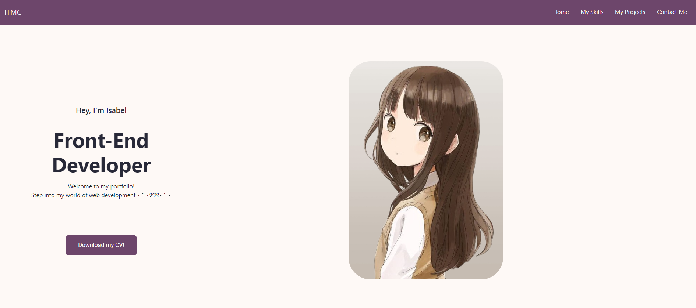
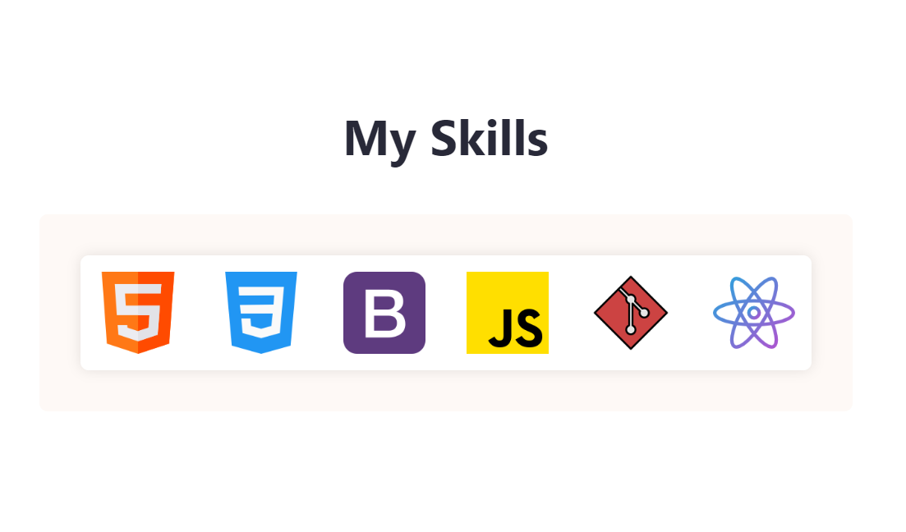
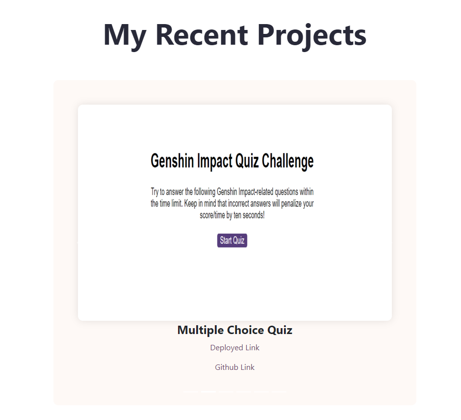
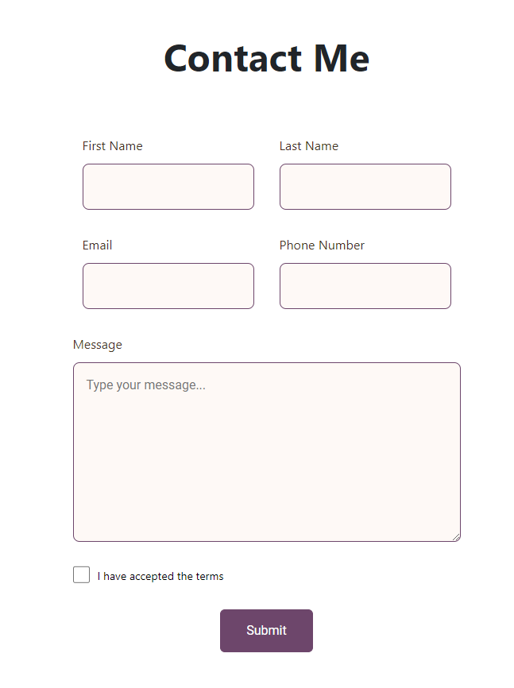

# My React Portfolio

## Description

Here is my portfolio for React! Presented in a modern, dynamic style, my portfolio highlights my abilities, completed projects, and contact details. It seeks to provide visitors a thorough picture of my accomplishments and areas of expertise with a modern and clean style.

## Installation 

To use this application, follow these steps:

1. Clone the repository to your local machine using `git clone`.
2. Navigate to the project directory.
3. Install dependencies by running `npm install`.

## Features

* Skills Display: Showcasing my competence with a range of tools and technologies.
* Projects Showcase: A list of my most recent projects complete with links and descriptions.
* Contact Form: Offering visitors an easy method to reach out to me.
* Responsive design: Providing the best possible viewing experience on all platforms.

## Technologies Used 
* JavaScript
* CSS

## Dependecies
* Bootstrap
* React
* React-bootstrap
* React-dom
* React-router-dom
* React-scroll

## License

This project is licensed under the MIT License.

## References

* https://www.w3schools.com
* https://stackoverflow.com
* Xpert Learning Assistant
* https://www.youtube.com
